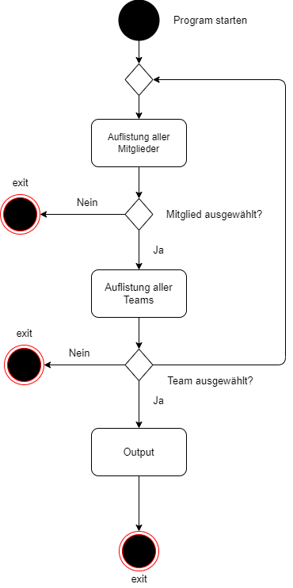

# Kompetenz 1

## Projekt / Umsetzung

**Themenbereich**: Volero Volleyball-Verein

Für dieses Kompetenz wird ein Stück Code erstellt, welches verschiedene Mitglieder des Vereins verwaltet. Jedes Mitglied mindestens einer Team-Gruppe zugewiesen sein, anstonsten wird eine Fehlermeldung angezeigt, dass ein Team ausgewählt werden muss.

**Hinweise für Lernende**: Im einfachsten Fall bilden sie die Führung durch die Navigation als Aktivitätsdiagramm ab.

