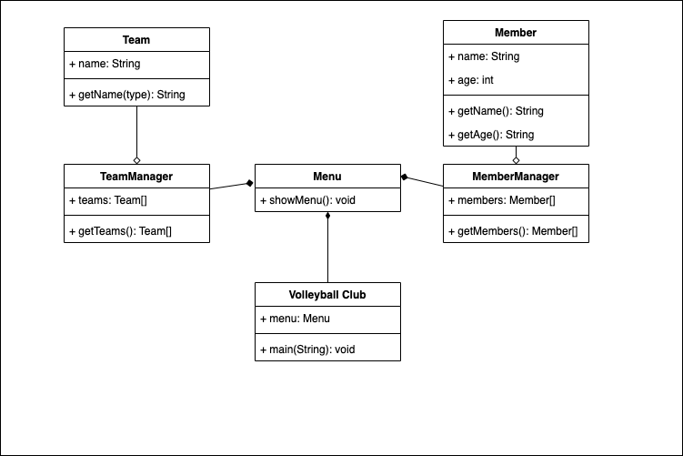

# K04

## Begriffe

- Assoziation:

eine Verbindung zwischen zwei Klassen. Es ermöglicht Objekten einer Klasse,
auf die Eigenschaften und Methoden von Objekten einer anderen Klasse zuzugreifen.

- Aggregation:

eine spezielle Art der Assoziation, die eine "besitzende"
Beziehung zwischen zwei Klassen darstellt. Eine Klasse besitzt die Eigenschaften und
Methoden einer anderer Klasse, ohne für die Verantwortlich zu sein.

- Komposition:

In Java ist eine Komposition eine spezielle Art der Aggregation, die eine enge "besitzende"
Beziehung zwischen zwei Klassen darstellt. Die "besitzende" Klasse ist von der anderen
Klasse abhängig und ihre Lebensdauer ist eng mit der Lebensdauer der anderen Klasse
verknüpft. Wenn die "besitzende" Klasse zerstört wird, werden auch die Objekte der anderen Klasse zerstört.

## UML

