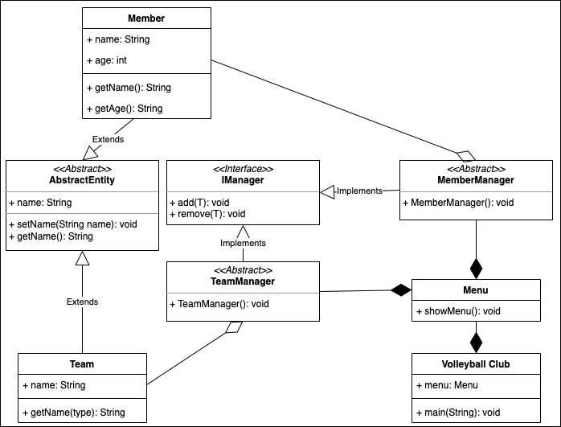

# K05

## Begriffe

### Vererbung

Mit einer Vererbung kann eine hirarchische Struktur von Klassen erstellt werden, und redunanter Code gespart werden.
Die Atribute und Methoden können so vererbt werden und müssen nicht mehr neu geschrieben werden.

### Abstrakte Klassen

Mit einer Abstrakten Klasse, können Objekteigenschaften einer bestimmten Gruppe, welche alle die selben eigenschaften haben, als Oberklasse gegeben werden, diese klasse ist keine Klasse welche zur Objekterzeugung dient. Die Eigenschaften können von anderen Klassen jegiglich übernommen werden.

### Interface

Ein Java Interface ist eine Art Klasse , die nur aus Konstanten und abstrakten Methoden besteht. In dem Interface kannst du also Konstanten und Funktionen in Form von abstrakten Methoden definieren. Der Methodenkörper wird dabei in der Klasse implementiert, in der du das Interface verwendest.

### Polymorphismus, zusammen mit overiding und overloading

Eine Methode ist polymorph, wenn sie in verschiedenen Klassen die gleiche Signatur hat, jedoch erneut implementiert ist.
So kann man diese Methoden mit der Anotation @Override überschreiben.
Auch können Methoden mit overloading den gleichen Namen haben, jedoch mit anderen Parametern.

